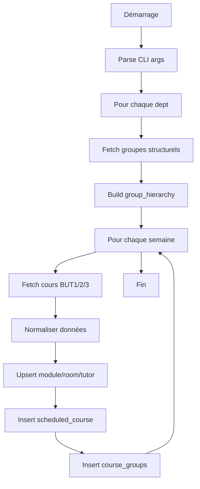

# API Emploi du Temps - Documentation développeur

## 🏗️ Architecture

### Stack technique

- **Runtime** : Node.js 20+ (ESM modules)
- **Framework** : Express.js 4.x
- **Base de données** : MariaDB 10.11+
- **ORM** : mysql2 (raw SQL)
- **API source** : flOpEDT REST API

### Structure du projet

```
backend/
├── db.js              # Configuration MySQL + pool de connexions
├── index.js           # Serveur Express + endpoints API
├── schema.sql         # Schéma de base de données
├── package.json       # Dépendances Node.js
└── scripts/
    └── sync.js        # Script de synchronisation flOpEDT → DB
```

---

## 🗄️ Schéma de base de données

### Tables principales

#### `scheduled_course`
Cours planifiés (table centrale).

| Colonne | Type | Description |
|---------|------|-------------|
| `id` | INT PK | Clé primaire auto-incrémentée |
| `external_id` | VARCHAR(255) UNIQUE | Identifiant unique (depuis API ou généré) |
| `dept` | VARCHAR(10) | Code département (INFO, CS, GIM, RT) |
| `train_prog` | VARCHAR(10) | Promotion (BUT1, BUT2, BUT3, CS1, etc.) |
| `promo_year` | INT | Année calendaire (2025, 2026, etc.) |
| `week` | INT | Semaine ISO (1-53) |
| `day` | VARCHAR(2) | Jour (mo, tu, we, th, fr) |
| `start_time` | INT | Heure de début (minutes depuis minuit) |
| `end_time` | INT | Heure de fin (minutes depuis minuit) |
| `type` | VARCHAR(50) | Type de cours (CM, TD, TP) |
| `module_id` | INT FK | Référence vers `module.id` |
| `room_id` | INT FK | Référence vers `room.id` |
| `tutor_id` | INT FK | Référence vers `tutor.id` |

**Index** :
- `idx_dept_week_year` : (dept, week, promo_year)
- `idx_schedule_time` : (day, start_time, end_time)
- `idx_external_id` : (external_id) UNIQUE

---

#### `course_groups`
Liaison Many-to-Many entre cours et groupes.

| Colonne | Type | Description |
|---------|------|-------------|
| `course_id` | INT FK | Référence vers `scheduled_course.id` |
| `group_name` | VARCHAR(100) | Nom du groupe (1A, 2B, 3, etc.) |

**Clé primaire composite** : (course_id, group_name)  
**Contrainte** : `ON DELETE CASCADE` → suppression du cours supprime les liaisons

---

#### `group_hierarchy`
Hiérarchie parent-enfant des groupes.

| Colonne | Type | Description |
|---------|------|-------------|
| `dept` | VARCHAR(10) | Département |
| `parent_group` | VARCHAR(100) | Groupe parent (ex: "1") |
| `child_group` | VARCHAR(100) | Groupe enfant (ex: "1A") |

Exemple :
```
dept=INFO, parent_group="1", child_group="1A"
dept=INFO, parent_group="1", child_group="1B"
```

---

#### `module`, `room`, `tutor`
Tables de référence normalisées.

**Clé unique composite** : (dept, name) ou (dept, username)

---

## 🔄 Script de synchronisation (`sync.js`)

### Flux de traitement



### Fonctions clés

#### `fetchScheduled(dept, week, year)`
Récupère les cours depuis l'API flOpEDT.

- Appelle `/fetch/scheduledcourses/` pour chaque promo (BUT1, BUT2, BUT3)
- Ajoute `_fetched_train_prog` à chaque cours pour traçabilité
- Gère les erreurs 404/406 (train_prog invalide)

```javascript
const items = await fetchScheduled('INFO', 36, 2025);
// [{ id: 123, day: 'mo', start_time: 480, _fetched_train_prog: 'BUT1', ... }]
```

---

#### `computeExternalId(dept, week, it)`
Génère un identifiant unique pour éviter les doublons.

**Priorité** :
1. Utiliser `it.id` de l'API si présent → `flopedt-${it.id}`
2. Sinon, générer un hash stable : `gen-${hash}-${timestamp}`

**Champs pris en compte** :
- dept, year, week, train_prog
- day, start_time, end_time
- room, module, tutor, groups

```javascript
const externalId = computeExternalId('INFO', 36, courseData);
// → "flopedt-12345" ou "gen-987654321-123456"
```

---

#### `saveScheduledBatch(conn, dept, week, year, groupsByPromo, allGroupsMap, items)`
Sauvegarde les cours en base de données.

**Transaction SQL** :
1. `upsertModule()` → Crée/récupère l'ID du module
2. `upsertRoom()` → Crée/récupère l'ID de la salle
3. `upsertTutor()` → Crée/récupère l'ID du tuteur
4. `INSERT ... ON DUPLICATE KEY UPDATE` → Upsert du cours
5. `INSERT IGNORE INTO course_groups` → Liaison cours-groupes

**Clé d'upsert** : `external_id` (UNIQUE)

---

#### `buildGroupHierarchy(conn, dept)`
Construit la table `group_hierarchy` depuis l'API `/groups/structural/tree/`.

Exemple de structure :
```json
{
  "name": "1",
  "children": [
    { "name": "1A", "children": [] },
    { "name": "1B", "children": [] }
  ]
}
```

Génère :
```sql
INSERT INTO group_hierarchy (dept, parent_group, child_group)
VALUES ('INFO', '1', '1A'), ('INFO', '1', '1B');
```

---

### Gestion des erreurs

| Erreur | Cause | Solution |
|--------|-------|----------|
| 404 `/groups/` | Endpoint inexistant | Fallback vers `/groups/structural/` |
| 406 `Multiple training programme` | `train_prog` invalide | Utiliser codes spécifiques (CS1/CS2/CS3) |
| Duplicate `external_id` | Hash collision | Ajouter timestamp dans `computeExternalId()` |

---

## 🌐 API Express (`index.js`)

### Architecture des endpoints

```javascript
// Pattern général
app.get("/api/{resource}", async (req, res) => {
  try {
    // 1. Validation des paramètres
    if (!req.query.requiredParam) {
      return res.status(400).json({ error: "Missing param" });
    }
    
    // 2. Requête SQL
    const [rows] = await pool.query(sql, params);
    
    // 3. Transformation des données
    const result = rows.map(transformFunction);
    
    // 4. Réponse JSON
    res.json(result);
  } catch (e) {
    console.error(e);
    res.status(500).json({ error: "Database error" });
  }
});
```

---

### Endpoint critique : `/api/edt/all`

#### Logique de filtrage des groupes

Le filtre groupe utilise une **logique hiérarchique** :

```sql
-- Un cours est inclus si :
-- 1. Il est pour un groupe exact demandé (ex: "1A")
-- 2. OU il est pour un parent du groupe demandé (ex: "1" si on demande "1A")
-- 3. OU il est pour un enfant du groupe demandé (ex: "1A"/"1B" si on demande "1")

WHERE EXISTS (
  SELECT 1 FROM course_groups cg2
  WHERE cg2.course_id = sc.id 
  AND (
    cg2.group_name IN (?) -- Exact match
    OR EXISTS (
      SELECT 1 FROM group_hierarchy gh
      WHERE gh.dept = sc.dept
      AND (
        (gh.parent_group IN (?) AND cg2.group_name = gh.child_group) -- Parent→Child
        OR (gh.child_group IN (?) AND cg2.group_name = gh.parent_group) -- Child→Parent
      )
    )
  )
)
```

**Exemple** :
- Requête : `?groups=1A`
- Cours inclus :
  - Cours avec groupe "1A" (exact)
  - Cours avec groupe "1" (parent de 1A)
  - Cours sans groupe (amphi commun)

---

### Fonctions utilitaires

#### `colorFor(name, light = false)`
Génère une couleur HSL stable depuis un nom.

```javascript
colorFor("ALGO") // → "hsl(234 55% 42%)"
colorFor("ALGO", true) // → "hsl(234 55% 88%)"
```

**Algorithme** :
1. Somme des codes ASCII du nom
2. Modulo 360 → Teinte (H)
3. Saturation fixe : 55%
4. Luminosité : 42% (foncé) ou 88% (clair)

---

#### `dayLetter(dbDay)`
Convertit le code jour DB vers la notation française.

```javascript
dayLetter("mo") // → "l" (lundi)
dayLetter("fr") // → "v" (vendredi)
```

---

## 🔐 Configuration réseau

### Architecture WireGuard

```
Internet ←→ VPS (152.228.219.56) ←→ WireGuard ←→ RPi (10.0.0.2)
                    ↓                                    ↓
                Nginx proxy                      Backend :8000
                Port 8000                        MariaDB :3306
```

### Bind sur WireGuard

```javascript
const host = process.env.HOST ?? '0.0.0.0';
app.listen(port, host, () => console.log(`API listening on ${host}:${port}`));
```

**Important** : Bind sur `0.0.0.0` pour accepter les connexions depuis WireGuard.

---

## 🧪 Tests et debugging

### Test des endpoints

```bash
# Sanity check
curl http://10.0.0.2:8000/api/depts

# Test avec filtres
curl "http://10.0.0.2:8000/api/edt/all?dept=INFO&train_prog=BUT1&week=36&year=2025&groups=1A" | jq

# Compter les résultats
curl "..." | jq 'length'

# Extraire un champ
curl "..." | jq '.[].module_abbrev'
```

---

### Debugging SQL

Activer les logs MySQL :

```javascript
// Dans db.js (temporaire)
export const pool = mysql.createPool({
  ...DB_CONFIG,
  debug: true // ⚠️ Ne pas commit en production
});
```

---

### Vérifier les doublons

```sql
-- Doublons d'external_id
SELECT external_id, COUNT(*) as cnt 
FROM scheduled_course 
GROUP BY external_id 
HAVING cnt > 1;

-- Cours sans groupes
SELECT sc.id, sc.module_id, 
       (SELECT COUNT(*) FROM course_groups WHERE course_id = sc.id) as grp_count
FROM scheduled_course sc
WHERE grp_count = 0;
```

---

## 🚀 Performance

### Index critiques

```sql
-- Pour les requêtes par semaine
CREATE INDEX idx_dept_week_year ON scheduled_course(dept, week, promo_year);

-- Pour les jointures
CREATE INDEX idx_course_id ON course_groups(course_id);
CREATE INDEX idx_group_name ON course_groups(group_name);
```

### Pool de connexions

```javascript
connectionLimit: 10 // Ajuster selon la charge
```

**Monitoring** :
```javascript
pool.on('connection', (conn) => console.log('New connection', conn.threadId));
pool.on('release', (conn) => console.log('Release connection', conn.threadId));
```

---

## 🐛 Points d'attention

### 1. Collision d'`external_id`

**Symptôme** : Cours manquants après sync.

**Cause** : Deux cours différents génèrent le même hash.

**Solution** : Ajouter un timestamp dans `computeExternalId()`.

---

### 2. Cours en amphi non visibles

**Symptôme** : Cours communs (sans groupes) absents des filtres.

**Cause** : SQL `EXISTS` trop restrictif.

**Solution** : Inclure explicitement les cours sans groupes.

```sql
WHERE (
  NOT EXISTS (SELECT 1 FROM course_groups WHERE course_id = sc.id)
  OR EXISTS (SELECT 1 FROM course_groups WHERE course_id = sc.id AND ...)
)
```

---

### 3. train_prog NULL

**Symptôme** : Cours avec `train_prog = NULL` affichés dans tous les filtres.

**Cause** : `promoOfGroup()` échoue à deviner la promo.

**Solution** : Utiliser `_fetched_train_prog` ajouté par `fetchScheduled()`.

---

## 📦 Déploiement

### PM2 Ecosystem

Créer `ecosystem.config.js` :

```javascript
module.exports = {
  apps: [{
    name: 'edt-api',
    script: './index.js',
    instances: 1,
    exec_mode: 'fork',
    env: {
      NODE_ENV: 'production',
      PORT: 8000,
      HOST: '0.0.0.0'
    },
    error_file: '/var/log/edt-api-error.log',
    out_file: '/var/log/edt-api-out.log',
    log_date_format: 'YYYY-MM-DD HH:mm:ss Z'
  }]
};
```

Commandes :
```bash
pm2 start ecosystem.config.js
pm2 save
pm2 startup
```

---

### Nginx reverse proxy

```nginx
server {
    listen 8000;
    server_name 152.228.219.56;
    
    location / {
        proxy_pass http://10.0.0.2:8000;
        proxy_http_version 1.1;
        proxy_set_header Host $host;
        proxy_set_header X-Real-IP $remote_addr;
        proxy_set_header X-Forwarded-For $proxy_add_x_forwarded_for;
        
        # Timeouts pour requêtes longues (sync)
        proxy_read_timeout 300s;
        proxy_connect_timeout 75s;
    }
}
```

---

## 🔄 Roadmap

### Améliorations futures

- [ ] Cache Redis pour `/api/edt/all`
- [ ] Webhook flOpEDT pour sync en temps réel
- [ ] API GraphQL pour requêtes complexes
- [ ] Export iCal des emplois du temps
- [ ] Notifications changements de cours

---

## �️ Maintenance et opérations

### Service systemd

Le service `edt-api.service` gère l'API en production sur le Raspberry Pi.

```bash
# Fichier de configuration
sudo nano /etc/systemd/system/edt-api.service

# Recharger après modification
sudo systemctl daemon-reload
sudo systemctl restart edt-api

# Surveiller l'état
watch -n 2 'sudo systemctl status edt-api --no-pager | head -20'
```

### Synchronisation automatique (Cron)

La synchronisation avec flOpEDT est automatique via cron (2x/jour).

```bash
# Éditer la configuration cron
crontab -e

# Format de la tâche actuelle
# 0 0,12 * * * = à 00h00 et 12h00 chaque jour

# Forcer une synchronisation manuelle
cd /srv/dev-disk-by-uuid-0818de14-ddf8-46a5-bf71-2ecaff879f70/apps/edt-iut/backend
node scripts/sync.js --weeks=1-53 --year=2025 --depts=INFO,CS,GIM,RT

# Surveiller les logs de synchronisation
tail -f sync.log
```

### Monitoring et debugging

```bash
# Vérifier la santé de l'API
curl -s http://localhost:8000/api/depts && echo " ✓ API OK" || echo " ✗ API KO"

# Tester un endpoint complet
curl -s "http://localhost:8000/api/edt/all?dept=INFO&train_prog=BUT1&week=41&year=2025" | jq '.courses | length'

# Logs en temps réel (3 sources)
sudo journalctl -u edt-api -f              # Logs systemd
tail -f backend.log                        # Logs application
tail -f sync.log                           # Logs synchronisation

# Statistiques base de données
docker exec mariadb mariadb -u flopedt_user -p'edtpassword' flopedt_db -e "
SELECT 
  dept, 
  train_prog, 
  COUNT(*) as cours_total,
  COUNT(DISTINCT week) as semaines,
  MIN(week) as semaine_min,
  MAX(week) as semaine_max
FROM scheduled_course 
WHERE promo_year = 2025
GROUP BY dept, train_prog;
"

# Performance monitoring
sudo journalctl -u edt-api --since "1 hour ago" | grep "GET /api" | wc -l  # Requêtes dernière heure
```

### Backup de la base de données

```bash
# Backup complet
docker exec mariadb mariadb-dump -u flopedt_user -p'edtpassword' flopedt_db > backup_$(date +%Y%m%d).sql

# Restauration
docker exec -i mariadb mariadb -u flopedt_user -p'edtpassword' flopedt_db < backup_20251007.sql

# Backup automatique quotidien (ajout cron)
# 0 3 * * * docker exec mariadb mariadb-dump -u flopedt_user -p'edtpassword' flopedt_db | gzip > /backups/edt_$(date +\%Y\%m\%d).sql.gz
```

---

## �📚 Ressources

- **flOpEDT API** : https://flopedt.iut-blagnac.fr/fr/api/
- **mysql2 docs** : https://sidorares.github.io/node-mysql2/
- **Express.js** : https://expressjs.com/
- **Systemd** : https://systemd.io/
- **Cron syntax** : https://crontab.guru/

---

## 🤝 Contribution

### Workflow Git

```bash
# Créer une branche
git checkout -b feature/my-feature

# Commits atomiques
git commit -m "feat: add endpoint /api/xyz"

# Push et PR
git push origin feature/my-feature
```

### Conventions de code

- **ESM modules** : `import`/`export` (pas de `require`)
- **Async/await** : Pas de callbacks
- **Nommage** : camelCase pour variables, PascalCase pour classes
- **SQL** : Uppercase pour keywords, lowercase pour identifiers

---

## 📞 Contact

Pour toute question technique : équipe dev IUT Blagnac
